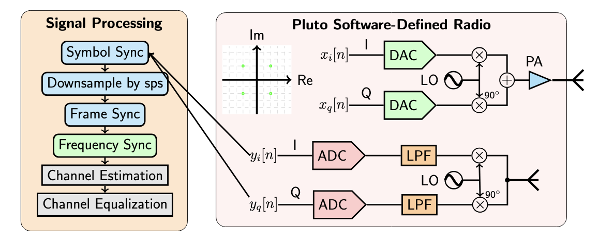
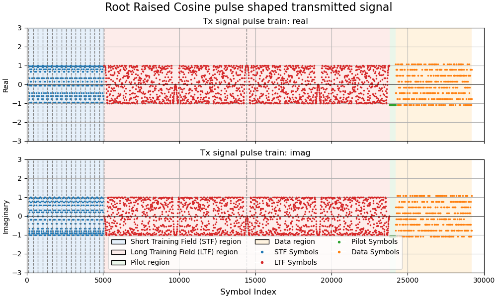

# Communication Chain on Software Defined Radio
The project consists of the following:
1. [System Design](#system-design)
1. [Pulse shaping](#pulse-shaping)
2. [Symbol and Frame Synchronization](#symbol-and-frame-synchronization)

## System Design

  
   
  <em>Figure 1: System Design</em>

As a preview, here are the steps taken inside the signal processing (yellow background) block.

- **Symbol Synchronization**: maximum output energy (MOE) is used as the criterion for choosing the symbol indices from all samples.

- **Frame Synchronization**: $N_{LTF}$ repeating long training fields (LTF) are used to synchronize the data frame.

- **Frequency Synchronization**: $N_{LTF}$ LTFs and $N_{STF}$ short training fields (STF) are used for coarse and fine frequency synchronization which arises from the difference in frequencies between the local oscillators on transmitter and receiver.

- **Channel Estimation**: dedicated pilot symbols are employed to estimate the impulse response of the channel.

- **Channel Equalization**: this step corrects phase shifts and amplitude scaling.

## Pulse Shaping
The purpose of pulse shaping is to constrain and suppress noise at the receiver side. A simple low-pass filter at the receiver will significantly decrease noise power. Without shaping at the receiver, the noise power will be infinity.
In addition, to maximize SNR[1](#1), a match filtering approach is used, which means that the transmitter and receiver each uses a root raised cosine pulse shape.

Transmitted signal with Root Raised-Cosine pulse shaping at the transmitter,

  
   
  <em>Figure 2: RRC pulse shaped transmitted signal</em>

## Symbol and Frame Synchronization

## Appendix

### 1 
Match filter means $g_{rx}(t) = g_{tx}(-t)^*$. This can be proved using the definition of SNR and Cauchy-Schwarz inequality.

$$\text{SNR} = \frac{E_s \cdot |p(0)|^2}{N_o \cdot \| g_{rx} \|^2},$$
where $p(t) = g_{rx}(t) * g_{tx}(t)$ is the effective pulse shape. By definition of convolution,

$$
\begin{aligned}
  p(0) &= \int_{-\infty}^{\infty} g_{rx}(\tau) g_{tx}(0-\tau) d\tau \nonumber \\
  &= \int_{-\infty}^{\infty} g_{rx}(\tau) g_{tx}(-\tau) d\tau \nonumber \\
  |p(0)|^2 &= \left| \int_{-\infty}^{\infty} g_{rx}(\tau) g_{tx}(-\tau) d\tau \right|^2 \nonumber \\
  & \le \| g_{rx}\|^2 \cdot \| g_{tx} \|^2, && \text{(Cauchy Schwarz Inequality)}\nonumber
\end{aligned}$$
with equality satisfied when $g_{rx}(t) = c \cdot g_{tx}(-t)^* $ for any constant $c$.
